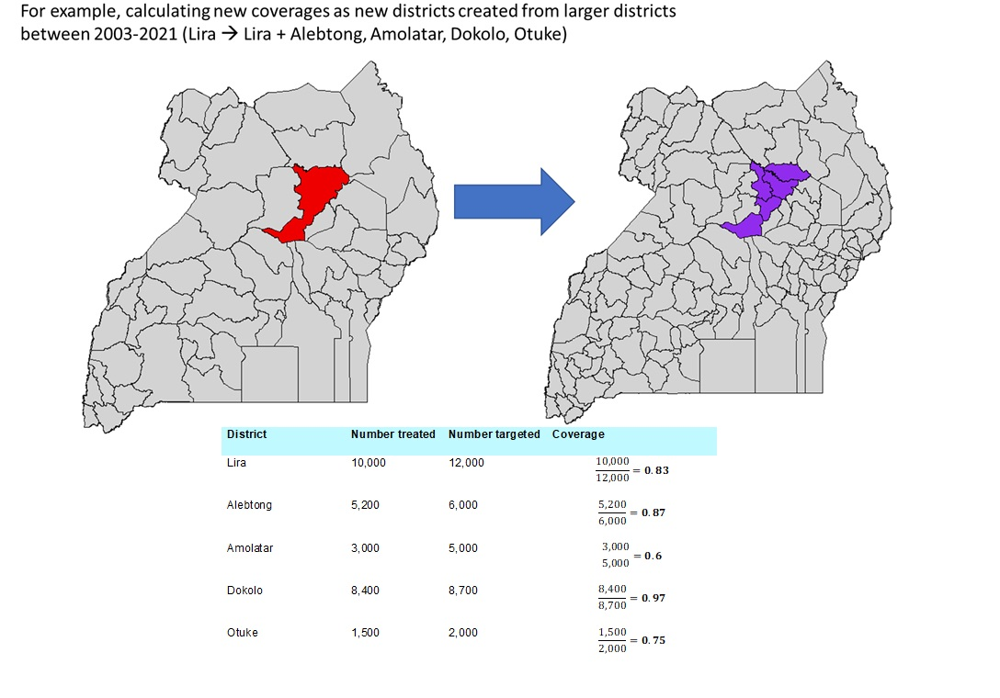
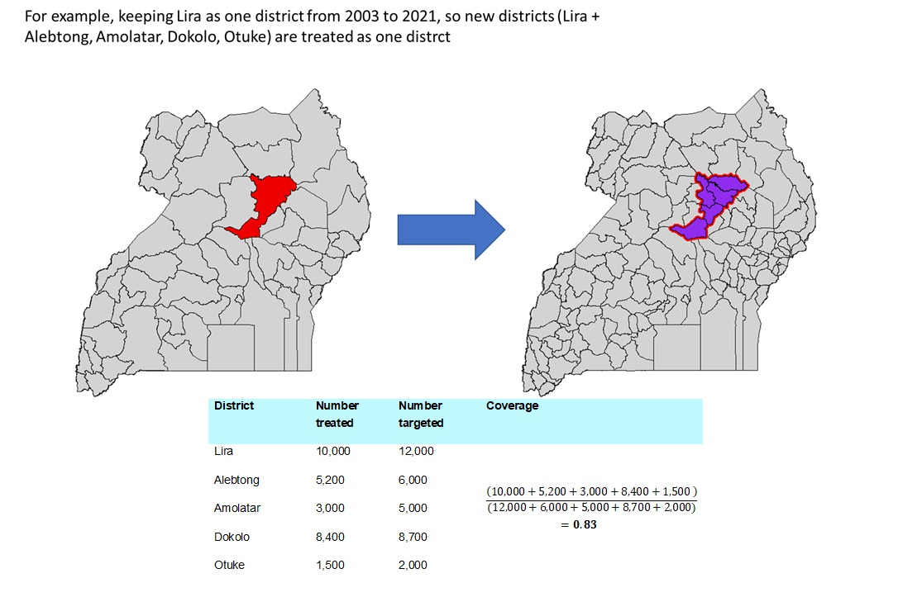

# Uganda MDA programme analysis for Taenia solium modelling project

## Background

## Approach taken to estimating coverages

### Estimating coverage in districts as new districts formed (2003-2020)

### Estimating coverage in districts as original districts (as of 2003)

## Code description

## Data availability
to add once DSA approved from MoH

## References
